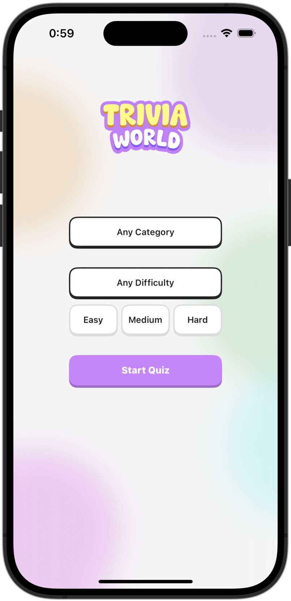
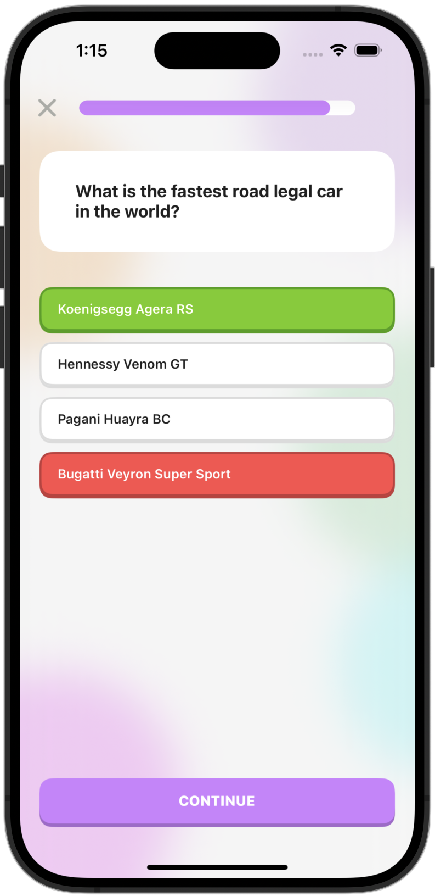
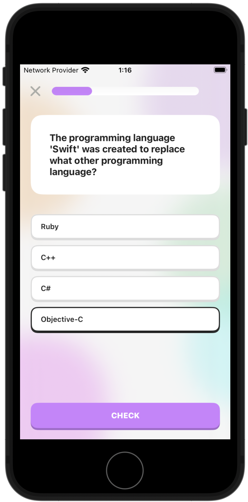

# Trivia World - a Simple iOS Trivia App

    &nbsp;&nbsp;
     &nbsp;&nbsp;
     

A trivia app that’s all about fun and simplicity. Pick a category, choose a difficulty level, and dive into the quiz. For quick trivia sessions or daily challenges.

## Keywords
- **Swift 5**
- **UIKit** (Programmatic UI)
- **API Integration**: `URLSession` and `URLRequest` to fetch data from the [Open Trivia Database](https://opentdb.com/api_config.php).
- **Delegation**
- **Concurrency**: `async/await` and `DispatchQueue.main` for handling asynchronous operations and updating the UI.
- **Press Style Buttons**: A custom `CALayer` that adds a press-like animation effect to buttons or any view.
- **UITableView**: `UITableView`, `UITableViewCell`, `UITableViewDelegate`, and `UITableViewDataSource` for displaying the answers.
- `UIMenu` and `UIDeferredMenu` for selecting a category.
- **UIProgressView**: Displays quiz progress with a `UIProgressView`.

## Features
1. **Selecting a Category**: Choosing a trivia category.
2. **Setting Difficulty Levels**: Selecting the difficulty level for the quiz.
3. **Taking the Quiz**:
   - Picking an answer and pressing "Check" to reveal if it is correct.
   - Highlighting incorrect answers in red and correct answers in green.
   - Locking answers after pressing "Check" to prevent further selections.
4. **Tracking Progress**: Viewing quiz progress through a dynamic progress bar.
5. **Displaying Results**: Showing a summary of the total number of correct answers versus the total questions at the end of the quiz.

**Side Note:** (Honestly) I built this app because I started to feel dumber and wanted to challange my overall knowledge. Not knowing some questions is a humbling experience, but it's fun and, most importantly, free of those ads. Next quiz immediately pliz, tnx.

## Demonstration

| Starting a Quiz | Ending a Quiz |
| --- | --- |
|  |   |
